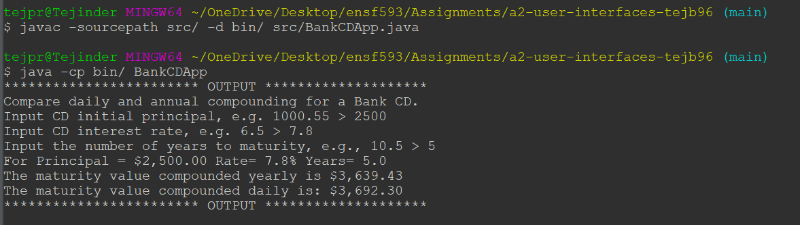

# Days in Month report
Author: Tejpreet Bal

## UML class diagram

## Execution and Testing

How to run the program:
To run from command line, first compile with `javac -sourcepath src/ -d bin/ src/BankCDApp.java` and run with `java -cp bin/ BankCDApp`. See screenshot below for an example terminal session.

Alternatively, in Eclipse, right-click on `BankCDApp.java` in the `Package Explorer` and select `Run As->Java Application`.

# Reflection

I liked how the class that used scanner was already provided and I was able to go through the code to learn better how it is used. I find it difficult to make the PlantUML diagrams before starting the coding.
