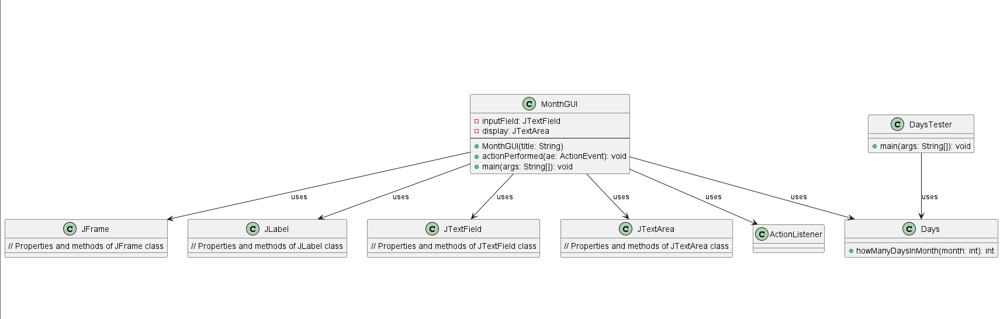
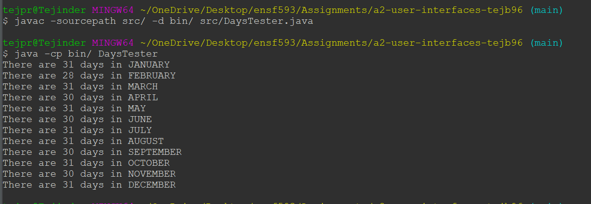
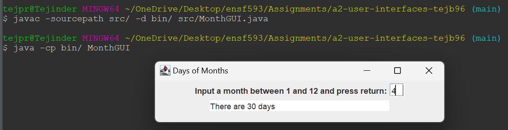

# Days in Month report
Author: Tejpreet Bal

## UML class diagram

## Execution and Testing

**Testing `Days` class**
 
How to run the program:
To run from command line, first compile with `javac -sourcepath src/ -d bin/ src/DaysTester.java` and run with `java -cp bin/ DaysTester`. See screenshot below for an example terminal session.

Alternatively, in Eclipse, right-click on `DaysTester.java` in the `Package Explorer` and select `Run As->Java Application`.

**Days in Month GUI Usage**

How to run the program:
To run from command line, first compile with `javac -sourcepath src/ -d bin/ src/MonthGUI.java` and run with `java -cp bin/ MonthGUI`. See screenshot below for an example terminal session.

Alternatively, in Eclipse, right-click on `MonthGUI.java` in the `Package Explorer` and select `Run As->Java Application`.

